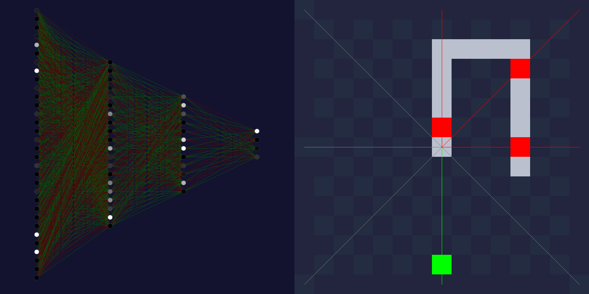

# PySnake

**Deep Learning** and **Genetic Algorithm** applied to the snake game.

## Overview

**PySnake** is an artificial intelligence that learns to control a snake. This AI learns to recognize its environment and choose the best direction to survive.
This model uses Genetic Algorithm theory, as there is no training data provided. Genetic Algorithm provides an alternative as each agents (snakes) learned to evolve in a new environment.

  <b>PySnake Interface</b> 
  
   

### Snake Game

The game is simple. The player / AI control a snake in four directions : UP, RIGHT, DOWN, LEFT. The goal is to eat as many apples as possible, increasing the snake's length.
The snake dies when it eats itself or crash in a wall.

### SAGA

The model has been trained on [SAGA servers](https://documentation.sigma2.no/quick/saga.html), in 3000 generations of 1500 snakes each.
With 8GB ram and 4 nodes, the training session lasted 4 days.

## Getting Started

### Config

The application settings are available from the config.ini file. You can create a custom one, as long as you have the necessary parameters : 

<table>
  <tr>
    <th colspan="3"><b>Config.ini File</th>
  </tr>
  <tr>
    <th><b>Parameter</th>
    <th><b>Type</th>
    <th><b>Description</th>
  </tr>
  <tr>
    <th colspan="3"><b>Game </th>
  </tr>
  <tr>
    <td><b>board_size </td>
    <td><i>tuple(int, int) </td>
    <td>Size of the game, in number of cells. <i>Default is (15, 15).</td>
  </tr>
  <tr>
    <td><b>seed </td>
    <td><i>int or None </td>
    <td>Fix random numbers. <i>Default is None.</td>
  </tr>
  <tr>
    <th colspan="3"><b>WindowGame </th>
  </tr>
  <tr>
    <td><b>render </td>
    <td><i>bool </td>
    <td>Display a window for the game in pygame.  It can be better to set False when training. <i>Default is True.</td>
  </tr>
  <tr>
    <td><b>show_grid </td>
    <td><i>bool </td>
    <td>Show a grid on the game.  You can activate it by pressing the <b>key g.</b> <i>Default is True.</td>
  </tr>
  <tr>
    <td><b>show_vision </td>
    <td><i>bool </td>
    <td>Show the snakes' vision. You can activate it by pressing the <b>key v.</b> <i>Default is False.</td>
  </tr>
  <tr>
    <td><b>cell_size </td>
    <td><i>int </td>
    <td>Width & height of a cell, in pixel. <i>Default is 50.</td>
  </tr>
  <tr>
    <td><b>fps_play </td>
    <td><i>int </td>
    <td>FPS of the playble game. <i>Default is 10.</td>
  </tr>
  <tr>
    <td><b>fps_train </td>
    <td><i>int </td>
    <td>FPS when training snakes. <i>Default is 1000.</td>
  </tr>
  <tr>
    <th colspan="3"><b>Snake </th>
  </tr>
  <tr>
    <td><b>length </td>
    <td><i>int </td>
    <td>Initial length of a snake. <i>Default is 3.</td>
  </tr>
  <tr>
    <td><b>vision_type </td>
    <td><i>str </td>
    <td>Vision type used as input in the neural network. If "distance", it will normalize distance from detected objects in a range from 0 to 1. If "binary", it will one-hot encoded in 3-bit as follow :  is there a wall ? is there an apple ? is there a snake ? <i>Default is "distance".</td>
  </tr>
  <tr>
    <td><b>vision_mode </td>
    <td><i>int </td>
    <td>Number of vision / ray object used to detect objects. <i>Default is 8.</td>
  </tr>
  <tr>
    <td><b>max_lifespan </td>
    <td><i>int or None </td>
    <td>Maximal lifespan of a snake. Note that a snake that still score 0 after 100 steps will die. <i>Default is 1000.</td>
  </tr>
  <tr>
    <th colspan="3"><b>NeuralNetwork</th>
  </tr>
  <tr>
    <td><b>hidden_layers </td>
    <td><i>list(*int) </td>
    <td>Hidden layers dimensions. <i>Default is [20, 12]</td>
  </tr>
  <tr>
    <td><b>activation_hidden </td>
    <td><i>function </td>
    <td>Activation function used in the hidden layers. Options are sigmoid, tanh, relu, leaky_relu, linear, softmax. You can add in addition custom function. <i>Default is relu.</td>
  </tr>
  <tr>
    <td><b>activation_output </td>
    <td><i>function </td>
    <td>Activation function used in the last layer. Options are sigmoid, tanh, relu, leaky_relu, linear, softmax You can add in addition custom function. <i>Default is softmax. </td>
  </tr>
  <tr>
    <th colspan="3"><b>GeneticAlgorithm </th>
  </tr>
  <tr>
    <td><b>save_best_individuals </td>
    <td><i>bool </td>
    <td>Save the best individuals from a generation. <i>Default is True.</td>
  </tr>
  <tr>
    <td><b>save_generations </td>
    <td><i>bool </td>
    <td>Save all individuals from a generation. <i>Default is False.</td>
  </tr>
  <tr>
    <td><b>save_steps </td>
    <td><i>int </td>
    <td>Save each x steps. <i>Default is 20.</td>
  </tr>
  <tr>
    <td><b>save_dir </td>
    <td><i>str </td>
    <td>Directory where individuals are saved. <i>Default is "saves"</td>
  </tr>
  <tr>
    <td><b>num_generations </td>
    <td><i>int </td>
    <td>Number of generations. <i>Default is 3000.</td>
  </tr>
  <tr>
    <td><b>num_parents </td>
    <td><i>int </td>
    <td>Number of parents. Parents won't have mutated genes and crossover. <i>Default is 500.</td>
  </tr>
  <tr>
    <td><b>num_offspring </td>
    <td><i>int </td>
    <td>Number of offspring. Offspring may have mutated genes and crossover. <i>Default is 1000.</td>
  </tr>
  <tr>
    <td><b>probability_SBX </td>
    <td><i>float </td>
    <td>Probability that Simulated Binary Crossover (SBX) occurs. <i>Default is 0.5.</td>
  </tr>
  <tr>
    <td><b>probability_SPBX </td>
    <td><i>float </td>
    <td>Probability that Single Point Binary Crossover (SPBX) occurs. <i>Default is 0.5.</td>
  </tr>
  <tr>
    <td><b>eta_SBX </td>
    <td><i>int </td>
    <td>eta parameter for Simulated Binary Crossover. <i>Default is 100.</td>
  </tr>
  <tr>
    <td><b>mutation_rate </td>
    <td><i>float </td>
    <td>Probability that a chromosome mutate. <i>Default is 0.005.</td>
  </tr>
</table>

  

### Play

### Train

#### Save

#### Load

## Development

### Vision

  <b>8-mode vision</b> 
  
   

### Neural Network

### Genetic Algorithm
